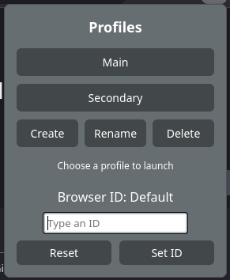
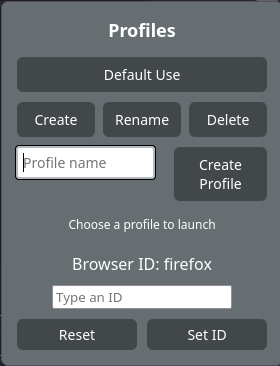

# Profile_Launcher_Firefox_Addon
A simple Firefox addon that lets you open new instances of differents profiles easier, even from others browsers

 

Addon Link: https://addons.mozilla.org/en-US/firefox/addon/profile-launcher/

This addon connects to a python script through Firefox native-messaging since addons cant directly interact with the profiles.

 IMPORTANT 
Due to this limitation you must have python installed on your system, if using windows remember to check the Add to Path checkbox during the python instalation. 
Besides having the addon you must run the pl_installer on this repo and that will set up the native-messaging and everything else necesary.

 NOTICE 
On Windows firefox cant open graphical applications from the addons, so when clicking the profile it will open a folder with a bat file inside and you must open that in order to open the new browser instance.
Due to this limitation the Create New Profile button from the addon will only show on linux, since on Windwos would be easier to go to about:profiles to create a new one

The addons does not currently handle renaming and removing profiles so for that still have to go to about:profiles
